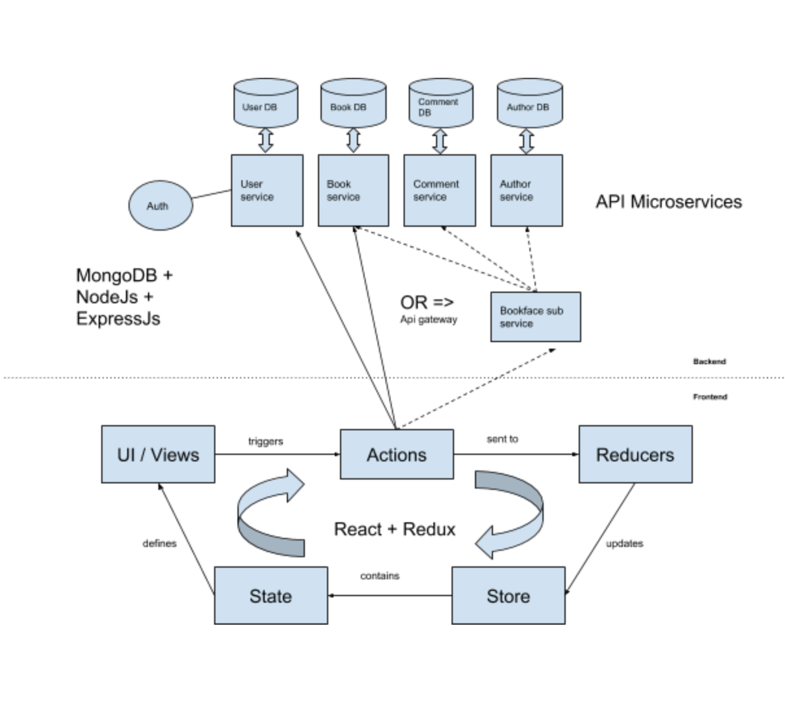

## Architecture
This application is an example solution for a coursework programming task using nodejs as part of accomplishing the CBSD module at Birkbeck, University of London.

*The architecture showing the microservices as RESTful API and the frontend solution using React+Redux*

This solution is using the microservices architecture for the **backend** in which each department is a seperate service. These services are fully decoupled and can be listed as below:

- user service
    - has its own database
    - provides CRUD as RESTful API through its own URI: http://localhost:3001/user
    - covers login, authentication and registration modules
    
- book service
    - has its own database
    - provides CRUD as RESTful API through its own URI: http://localhost:3002/book
    - covers books module
    
- comment service
    - has its own database
    - provides CRUD as RESTful API through its own URI: http://localhost:3003/comment
    - covers comments on a specific book

As well as author service.

These services look sometime redundant and they are too. The concept of DRY doesn't fit here, because we're applying microservices best practices. While these services are fully autonomous and rely on their own database, they can be deployed fully independently and can be scaled according to the load.

There's another layer that combine multiple services and supply one single API offered by the endpoint http://localhost:3010

## Database
Mongodb is a docuemnt database that offers quering and indexing with the ability to scale rapidly.

## Authentication
Authentication made easy using JSON Web Token technology. JWT is an industry standard RFC 7519 method for representing claims securely between two parties.

## Presentation
This application provides web portfolio using frontend technology like reactjs which is a great example of component based software solution and redux for state management. The client application is running under http://localhost:3000 and will connect to the available APIs above to collect data and display them by rendering the appropriate components.

The client application here is taking some load from the backend by using the client device to compute the data coming from different api endpoints. Devices these days are well equipped and can reduce the load on the backend servers through useful design by embracing immutability to avoid memory leaks and virtual dom for speed of rendering.

Choosing react for the forntend implementation brings another advantage by using the same code base without the need to port the codebase to work on mobile devices that runs iOS or Android by relying on react-native.

## Future work
- Add authentication strategy to all services in order to check token from header using jwtoken without depending on user service
- Add comment component
- Create admin page to manage user, books and comments by granting access to users with admin role

